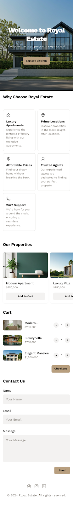

# Royal Estate Website

## Overview
Royal Estate is a modern, responsive real estate website designed to showcase properties elegantly and allow users to explore listings, add properties to a cart, and contact the agency easily. This project demonstrates HTML, CSS, and JavaScript skills, including DOM manipulation and form validation.

## Features
- **Responsive Design:** Works on all device sizes (mobile, tablet, desktop)
- **Property Listings:** Display properties with images, prices, and "Add to Cart" functionality
- **Interactive Cart:** Add and view properties in a cart
- **Contact Form:** Fully functional form with validation
- **Theme Toggle:** Switch between light and dark mode with a crescent moon icon
- **Navigation Bar:** Sticky header with logo and easy page navigation

## Technologies Used
- **HTML5 & CSS3:** Structure and styling of the website
- **JavaScript:** DOM manipulation, event handling, and form validation
- **Responsive Design:** Ensuring mobile-friendly layouts
- **Resources & Learning:**
  - HTML & CSS basics learned from [SheCodes.io](https://www.shecodes.io/)
  - DOM manipulation, Regex, and form validation from [MDN](https://developer.mozilla.org/) and [FreeCodeCamp](https://www.freecodecamp.org/)

## Code Structure
- `index.html` – Contains all the website structure, header, hero section, features, properties, contact form, and footer.
- `style.css` – Styles all sections, including header, hero, features, products, contact form, and footer. Includes responsive styles for mobile devices.
- `script.js` – Handles interactive elements such as theme toggle, add to cart, and form submission.

## HTML & CSS Example Snippets

### HTML
```html
<header style="background-image: url('images/header-bg.jpg');">
  <div class="header-container">
    <div class="logo">
      
      <span>Royal Estate</span>
    </div>
    <nav>
      <ul>
        <li><a href="#hero">Home</a></li>
        <li><a href="#features">Features</a></li>
        <li><a href="#cart">Properties</a></li>
        <li><a href="#contact">Contact</a></li>
      </ul>
    </nav>
    <button id="theme-toggle" title="Toggle Theme">🌙</button>
  </div>
</header>

## 📸 Screenshots

### Stitch AI Design Inspiration


### Final Landing Page


